# ProxyPass

### Introduction

You can join the [Discord](https://discord.gg/5z4GuSnqmQ) for help with this fork. ProxyPass allows developers to MITM a vanilla client and server without modifying them. This allows for easy testing of the Bedrock Edition protocol and observing vanilla network behavior. This fork of ProxyPass is designed to work in online mode. It also includes submodules of the Network and Protocol libraries, which have been modified to work with more servers than the original libraries. This setup is also more convenient for developers trying to debug these libraries.

### Usage

If trying to use ProxyPass on the same machine as the client (Windows), you will need to disable loopback restrictions. This can be done by running the following command(s) in an *administrator* PowerShell prompt:

```ps1
# Release Version
CheckNetIsolation LoopbackExempt -a -n="Microsoft.MinecraftUWP_8wekyb3d8bbwe"
# Preview Version
CheckNetIsolation LoopbackExempt -a -n="Microsoft.MinecraftWindowsBeta_8wekyb3d8bbwe"
```

Next, download the latest [ProxyPass.jar](https://github.com/Kas-tle/ProxyPass/releases/latest/download/ProxyPass.jar) from the [releases](https://github.com/Kas-tle/ProxyPass/releases) page. Then, run the jar file with `java -jar ProxyPass.jar`.

Run once to create a `config.yml` file, or create one like so in the same directory as the jar file:

```yaml
## Address proxy will bind to.
proxy:
  host: 127.0.0.1
  port: 19122
## Destination server which the client will connect to.
destination:
  host: 127.0.0.1
  port: 19132
## Run the proxy in online mode. This will require login with a Microsoft account on start.
online-mode: true
## Save credentials when in online mode for future logins.
save-auth-details: true
## Maximum of clients which can connect to ProxyPass. If this should be disabled, set it to 0.
max-clients: 0
## Encode and decode packets to test protocol library for bugs
packet-testing: false
## Log packets for each session
log-packets: true
## Where to log packet data
## Valid options: console, file or both
log-to: file
## If ProxyPass should follow transfer packets.
follow-transfers: true
## If ProxyPass should download packs from the destination server.
## This will only download packs if the client has not downloaded them yet.
download-packs: true

## Inverts the list below
invert-ignored-list: false
## Packets to ignore to make your log more refined. These default packet are generally spammed
ignored-packets:
  - "NetworkStackLatencyPacket"
  - "LevelChunkPacket"
  - "MovePlayerPacket"
  - "PlayerAuthInputPacket"
  - "NetworkChunkPublisherUpdatePacket"
  - "ClientCacheBlobStatusPacket"
  - "ClientCacheMissResponsePacket"
```

The destination field also supports special joining types for featured servers by experience ID, realms, and LAN games:

<details>

<summary>Featured Servers by Title</summary>

```yaml
destination:
  # Joins a featured server based on its title, looking up the experience ID if needed
  featured-server-title: "SoulSteel"
```

</details>

<details>

<summary>Featured Servers by Experience ID</summary>

```yaml
destination:
  # Joins a featured server based on its experience ID
  experience-id: "e3da296b-8be0-4d79-8608-e53d60531b7b"
```

</details>

<details>

<summary>LAN Games</summary>

```yaml
destination:
  host: 192.168.0.2 # LAN server IP
  port: 7551 # Nethetnet discovery occurs on port 7551 by default
  transport: nethernet # LAN now uses Nethernet transport
```

</details>

<details>

<summary>Realms</summary>

```yaml
destination:
  # Join a realm by specifying its name
  realm-name: MyRealm
  transport: nethernet # Realms now uses Nethernet transport
```

</details>

<details>

<summary>Nethernet ID</summary>

```yaml
destination:
  # Join a server by its Nethernet ID
  nethernet-id: 18eaa765-c0b4-44ac-9bba-7dca64ebf990
  transport: nethernet
```

</details>

On attempting to connect in online mode, your default web browser will direct you to a Microsoft login page requesting a token. This token has been copied to your clipboard, which you can paste into the prompt to continue. You will then be prompted to login with your Microsoft account, which of course must be associated with a valid Xbox Live account with a Minecraft character. Note that some servers may disconnect you if this process takes to long. If this is the case, simply leave ProxyPass running and login again after completing this initial login process. You will not be prompted to login again as long as ProxyPass is still running. By default, your credentials for future logins are saved. This can be disabled by setting `save-auth-details` to `false` in the `config.yml` file.

### Building & Running

This project uses git submodules. To clone:

```sh
git clone https://github.com/Kas-tle/ProxyPass.git --recursive
```

If you have already cloned the repository, you can initialize the submodules with:

```sh
git submodule update --init --recursive
```

To produce a jar file, run `./gradlew build` in the project root directory. This will produce a jar file in the `build/libs` directory.

If you wish to run the project from source, run `./gradlew run` in the project root directory.

### Project Structure

This project utilizes git submodules and [Gradle Composite Builds](https://docs.gradle.org/current/userguide/composite_builds.html) to include modified versions of the Protocol and Network libraries. These libraries are located in the `protocol` and `network` directories respectively. Any changes made to these libraries can be committed within their respective directories.

ProxyPass directly depends on the protocol submodule via the root [settings.gradle.kts](./settings.gradle.kts). Protocol then depends on the network submodule via its own [settings.gradle.kts](https://github.com/Kas-tle/Protocol/blob/50836b73f09103de9e5539c14da3fe05deec6c54/settings.gradle.kts). We can observe in a [gradle build scan](https://scans.gradle.com/s/gu5fploqzyafs) that dependency resolution for both [Protocol](https://scans.gradle.com/s/gu5fploqzyafs/dependencies?focusedDependency=WzAsMSwxMDAsWzAsMSxbMTAwXV1d&focusedDependencyView=details&toggled=W1swXSxbMCwxXV0) and [Network](https://scans.gradle.com/s/gu5fploqzyafs/dependencies?focusedDependency=WzMsMSwyMzIsWzMsMSxbMjMyXV1d&focusedDependencyView=details&toggled=W1szXSxbMywxXV0) were selected by composite build substitution rather than from a Maven repository.

### Packet Flows

#### Raknet

---

<picture>
  <source media="(prefers-color-scheme: dark)" srcset=".github/readme/protocol_raknet_dark.svg">
  
</picture>

#### Nethernet

---

<picture>
  <source media="(prefers-color-scheme: dark)" srcset=".github/readme/protocol_nethernet_dark.svg">
  
</picture>

### Links
- [Releases](https://github.com/Kas-tle/ProxyPass/releases)
- [Auth Library](https://github.com/RaphiMC/MinecraftAuth) used in this project by [RaphiMC](https://github.com/RaphiMC)
- [Original Protocol Library](https://github.com/CloudburstMC/Protocol) used in this project by [CloudburstMC](https://github.com/CloudburstMC)
- [Original Network Library](https://github.com/CloudburstMC/Network) used in this project by [CloudburstMC](https://github.com/CloudburstMC)
- [Original ProxyPass](https://github.com/CloudburstMC/ProxyPass) by [CloudburstMC](https://github.com/CloudburstMC)
